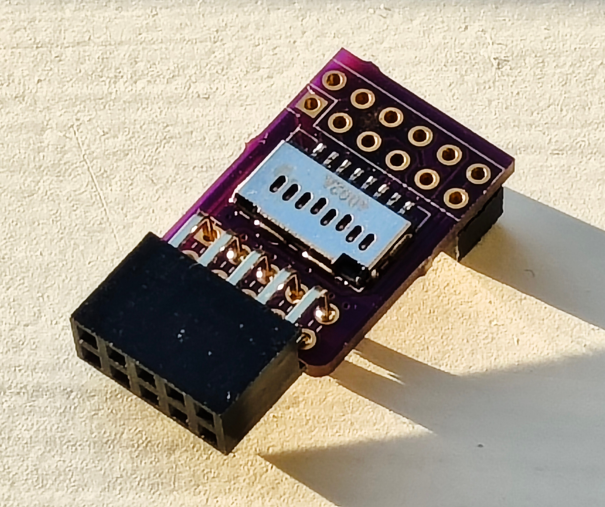

# A MicroSD and PMOD adapter for the Agilex 5 E-Series Premium Devkit

|  Agilex 5         |  J9  |  PMOD  |  Micro SD  |
| ----------------- | ---- | ------ | ---------- |
|  3.3V             |  1   |  11,12 | 4 VDD      |
|  BU31  HVIO_6A_5  |  2   |  1     | 2 DAT3/CD  |
|  BU28  HVIO_6A_1  |  3   |  2     | 8 DAT1     |
|  BM28  HVIO_6A_6  |  4   |  3     | 3 CMD      |
|  BP31  HVIO_6A_2  |  5   |  4     | 1 DAT2     |
|  BF21  HVIO_6B_1  |  6   |  5     | 7 DAT0     |
|  BR28  HVIO_6A_3  |  7   |  6     | 9 DET      |
|  BM31  HVIO_6A_8  |  8   |  7     | 5 CLK      |
|  BR31  HVIO_6A_4  |  9   |  8     | -          |
|  GND              |  10  |  9,10  | 6 VSS      |
